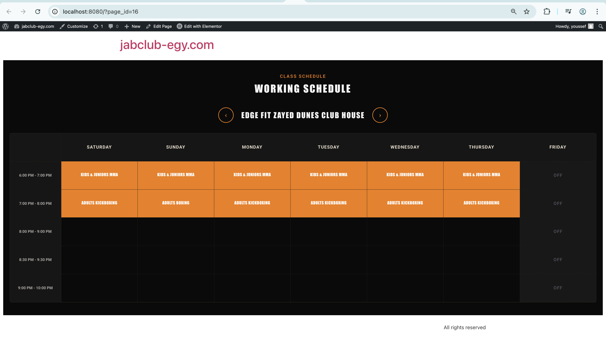
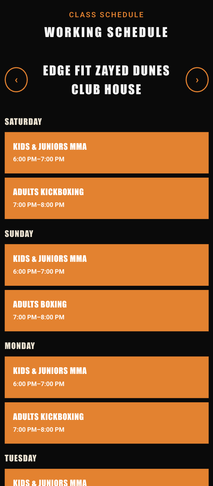
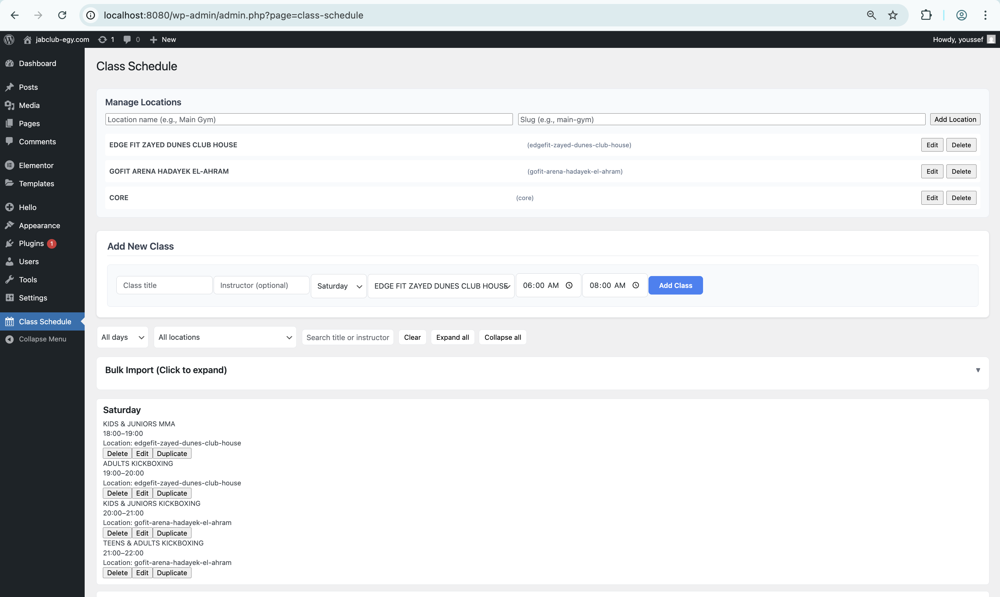

# ZakFit Class Schedule - WordPress Plugin

> **Complete WordPress Development Environment + Plugin**
> 
> This repository contains a full WordPress development setup with the Class Schedule plugin pre-installed and configured. Clone, run, and see it working immediately!

A dynamic, responsive WordPress plugin for displaying weekly class schedules with a modern grid layout. Perfect for gyms, fitness centers, educational institutions, and any organization that needs to showcase their weekly programs.


*Desktop grid view with location switching*




*Mobile view with location switching*


*Admin interface with bulk import and streamlined editing*

## 🏗️ **Repository Structure**

```
zakfit/
├── 🔧 docker-compose.yml           # WordPress + MySQL setup
├── 🔧 README-LOCAL-DEV.md          # Development guide
├── 📦 wp-content/plugins/class-schedule/  # ← THE PLUGIN
│   ├── class-schedule.php          # Main plugin file
│   ├── build/                      # Production assets
│   │   ├── admin.js               # Admin interface
│   │   ├── public.js              # Frontend renderer
│   │   └── *.css                  # Styling
│   └── src/                       # Source files
└── 🌐 wp-content/                  # Full WordPress environment
```

**Two ways to use this repo:**
1. **Full Development** - Clone and run the complete WordPress environment
2. **Plugin Only** - Extract `/wp-content/plugins/class-schedule/` for your site

## ✨ Features

- **Dynamic Schedule Management** - Add, edit, and delete classes through WordPress admin
- **Modern Grid Layout** - Clean, professional design with time slots and day columns  
- **Fully Responsive** - Desktop grid view, mobile-friendly vertical layout
- **Location Switching** - Multiple gym locations with navigation arrows
- **Bulk Import** - CSV import for locations and classes
- **Inline Editing** - Streamlined admin interface with filters and search
- **Easy Integration** - Simple shortcode `[class_schedule]` or Gutenberg block
- **Fast & Lightweight** - Vanilla JavaScript, no external dependencies

## 🚀 Quick Start

### Option 1: Full Development Environment (Recommended)

1. **Clone & Run:**
   ```bash
   git clone https://github.com/yourusername/zakfit.git
   cd zakfit
   docker-compose up -d
   ```

2. **Access WordPress:**
   - Frontend: http://localhost:8080
   - Admin: http://localhost:8080/wp-admin
   - Plugin is pre-installed and ready!

3. **View Working Example:**
   - Schedule already populated with sample data
   - Test admin interface at "Class Schedule" menu
   - See frontend at any page with `[class_schedule]` shortcode

### Option 2: Plugin Only Installation

1. **Extract Plugin:**
   ```bash
   # Copy just the plugin folder to your WordPress
   cp -r wp-content/plugins/class-schedule/ /your-wordpress/wp-content/plugins/
   ```

2. **Or Download Zip:**
   - Download `class-schedule-plugin.zip` from releases
   - Upload via WordPress Admin → Plugins → Add New → Upload

3. **Activate & Configure:**
   - Go to WordPress Admin → Plugins → Activate "Class Schedule"
   - Navigate to "Class Schedule" menu to add your data

## 📖 Usage

### Admin Interface

#### ➕ **Adding Classes**
- **Class Title:** Name of the class (e.g., "BOXING", "CARDIO")
- **Instructor:** Teacher/trainer name (optional - can be left empty)
- **Day:** Monday through Sunday
- **Location:** Select from configured gym locations
- **Start/End Time:** Class duration (supports evening classes 6PM-10PM)

#### 🏢 **Managing Locations**
- **Add Location:** Name and URL-friendly slug (e.g., "main-gym")
- **Edit Location:** Click "Edit" to modify name/slug
- **Delete Location:** Remove unused locations

#### 📊 **Bulk Import (CSV)**
- **Locations CSV:** Format: `name,slug`
  ```
  Main Gym,main-gym
  Studio A,studio-a
  ```
- **Classes CSV:** Format: `title,instructor,day,locationId,start,end`
  ```
  BOXING,John Smith,mon,main-gym,18:00,19:00
  YOGA,,tue,studio-a,19:00,20:00
  ```

#### ✏️ **Inline Editing**
- **Edit Class:** Click "Edit" to modify all fields inline
- **Duplicate Class:** Copy existing class to create similar ones
- **Change Day:** Edit day with validation
- **Filters:** Filter by day, location, or search by title/instructor

### Frontend Display
- **Desktop:** Full grid with time slots (6AM-10PM) and day columns
- **Mobile:** Vertical list grouped by day with time display
- **Location Switching:** Navigation arrows to switch between gym locations
- **12-Hour Format:** Times displayed as 6:00 PM instead of 18:00
- **Responsive:** Automatically adapts to screen size

### Shortcode Options
```php
[class_schedule]                    // Shows all locations (with navigation)
[class_schedule location="main-gym"] // Shows specific location only
```

### Gutenberg Block
Search for "Class Schedule" in the block inserter and add to your page. Supports the same location parameter.

## 🎨 Customization

### Custom Styling
The plugin uses a dark theme with orange accents (JAB CLUB style):

```css
.class-schedule-wrapper {
  --primary-bg: #0a0a0a;        /* Dark background */
  --secondary-bg: #161616;      /* Card backgrounds */
  --accent-orange: #F27C00;     /* Primary orange */
  --accent-light: #FBA743;      /* Light orange */
  --text-primary: #EDE2D0;      /* Light text */
  --text-secondary: #B2ACA8;    /* Muted text */
}

/* Orange tiles with no rounded corners */
.cs-tile {
  background: #F27C00;
  border-radius: 0;
  color: #ffffff;
}
```

### Typography
- **Headers:** Anton font family (Google Fonts)
- **Body:** Roboto font family (Google Fonts)  
- **Times:** 12-hour format (6:00 PM instead of 18:00)

### Modify Time Slots
Edit the time slots in `/build/public.js` to extend hours:

```javascript
const slots = [
  {start:'06:00', end:'08:00', label:'6:00 AM - 8:00 AM'},
  {start:'18:00', end:'19:00', label:'6:00 PM - 7:00 PM'},
  {start:'19:00', end:'20:00', label:'7:00 PM - 8:00 PM'},
  {start:'20:00', end:'21:00', label:'8:00 PM - 9:00 PM'},
  {start:'21:00', end:'22:00', label:'9:00 PM - 10:00 PM'},
  // Add more slots...
];
```

## 🛠️ Development

### Local Development Setup

1. **Docker Environment:**
   ```bash
   docker-compose up -d
   ```
   Access: http://localhost:8080

2. **Manual Setup:**
   - Install WordPress locally
   - Copy plugin to `/wp-content/plugins/class-schedule/`

### File Structure
```
zakfit/                              # ← This repository
├── docker-compose.yml              # Local WordPress environment
├── README.md                       # This file
├── README-LOCAL-DEV.md             # Development guide
├── *.png                           # Screenshots
├── wp-content/
│   ├── plugins/
│   │   └── class-schedule/         # ← THE PLUGIN
│   │       ├── class-schedule.php  # Main plugin file
│   │       ├── build/              # Production assets
│   │       │   ├── admin.js       # Admin UI (filters, inline edit)
│   │       │   ├── admin.css      # Admin styles
│   │       │   ├── public.js      # Frontend renderer
│   │       │   ├── public.css     # Frontend styles
│   │       │   ├── block.js       # Gutenberg block
│   │       │   ├── block.css      # Block editor styles
│   │       │   └── uninstall.php  # Plugin cleanup
│   ├── themes/                    # WordPress themes
│   └── uploads/                   # Media files
└── Full WordPress installation    # Complete WP environment
```

### Production Ready
The plugin is built with vanilla JavaScript and works out-of-the-box - no build process required! Clean, lightweight, and production-ready.

## 🔧 Technical Details

### Database Storage
- **Classes:** JSON in WordPress options table (`class_schedule_data`)
- **Locations:** JSON in WordPress options table (`class_schedule_locations`)
- **No custom tables required** - Uses WordPress options API
- **Cache-busting:** Asset versions use `filemtime()` for fresh updates

### REST API
```php
// Get all classes
GET /wp-json/class-schedule/v1/schedule

// Get classes for specific location  
GET /wp-json/class-schedule/v1/schedule?location=main-gym

// Update classes (admin only)
POST /wp-json/class-schedule/v1/schedule
Body: {"classes": [...]}

// Get all locations
GET /wp-json/class-schedule/v1/locations

// Update locations (admin only)  
POST /wp-json/class-schedule/v1/locations
Body: {"locations": [...]}
```

### WordPress Hooks
- `register_activation_hook` - Initialize database options with default data
- `add_action('admin_menu')` - Register admin page ("Class Schedule")
- `add_action('admin_enqueue_scripts')` - Load admin assets with cache-busting
- `add_action('wp_enqueue_scripts')` - Load frontend assets with cache-busting
- `add_action('rest_api_init')` - Register API endpoints for classes and locations
- `add_shortcode('class_schedule')` - Register shortcode with location parameter
- `register_block_type` - Register Gutenberg block

## 📱 Responsive Breakpoints

- **Desktop (>768px):** Full grid layout with location navigation
- **Mobile (≤768px):** Vertical list layout grouped by day with times in cards

## 🎯 Use Cases

- **Multi-Location Gyms:** Different schedules per location (ZakFit, EdgeFit)
- **Fitness Centers:** Weekly class schedules with instructors
- **Martial Arts Schools:** Kids, teens, and adult programs
- **Educational Institutions:** Course timetables across campuses
- **Community Centers:** Program schedules by facility
- **Studios:** Workshop calendars with multiple rooms

## 🤝 Contributing

1. Fork the repository
2. Create a feature branch: `git checkout -b feature/amazing-feature`
3. Commit changes: `git commit -m 'Add amazing feature'`
4. Push to branch: `git push origin feature/amazing-feature`
5. Open a Pull Request

## 📝 License

This project is licensed under the GPL v2 or later - see the [LICENSE](LICENSE) file for details.

## 🆘 Support

- **Issues:** Create an issue on GitHub
- **Documentation:** See `/README-LOCAL-DEV.md` for development setup
- **WordPress:** Compatible with WordPress 6.0+, PHP 7.4+

## 🙏 Acknowledgments

- Built for ZakFit gym management
- Inspired by modern fitness schedule designs
- Uses WordPress best practices and coding standards

---

**Made by Youssef Madkour with ❤️ for the WordPress community**
