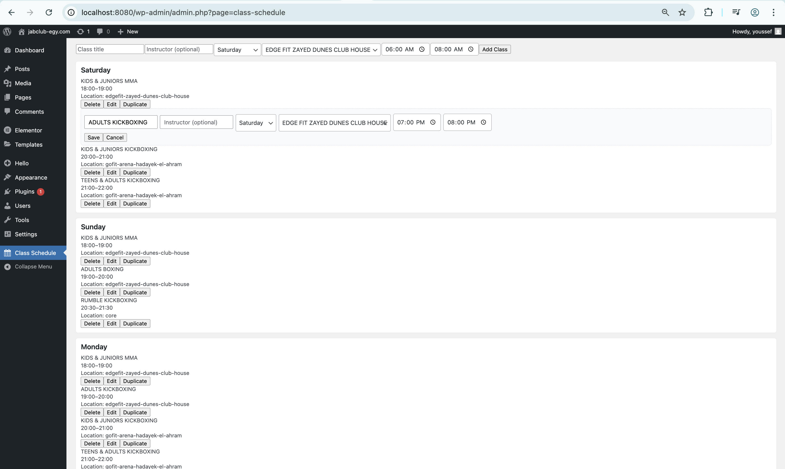

# ZakFit Class Schedule - WordPress Plugin

> **Complete WordPress Development Environment + Plugin**
> 
> This repository contains a full WordPress development setup with the Class Schedule plugin pre-installed and configured. Clone, run, and see it working immediately!

A dynamic, responsive WordPress plugin for displaying weekly class schedules with a modern grid layout. Perfect for gyms, fitness centers, educational institutions, and any organization that needs to showcase their weekly programs.


*Desktop grid view with location switching*


*Admin interface with bulk import and streamlined editing*


## 🏗️ **Repository Structure**

```
zakfit/
├── 🔧 docker-compose.yml           # WordPress + MySQL setup
├── 🔧 README-LOCAL-DEV.md          # Development guide
├── 📦 wp-content/plugins/class-schedule/  # ← THE PLUGIN
│   ├── class-schedule.php          # Main plugin file
│   ├── build/                      # Production assets
│   │   ├── admin.js               # Admin interface
│   │   ├── public.js              # Frontend renderer
│   │   └── *.css                  # Styling
│   └── src/                       # Source files
└── 🌐 wp-content/                  # Full WordPress environment
```

**Two ways to use this repo:**
1. **Full Development** - Clone and run the complete WordPress environment
2. **Plugin Only** - Extract `/wp-content/plugins/class-schedule/` for your site

## ✨ Features

- **Dynamic Schedule Management** - Add, edit, and delete classes through WordPress admin
- **Modern Grid Layout** - Clean, professional design with time slots and day columns  
- **Fully Responsive** - Desktop grid view, mobile-friendly vertical layout
- **Location Switching** - Multiple gym locations with navigation arrows
- **Bulk Import** - CSV import for locations and classes
- **Inline Editing** - Streamlined admin interface with filters and search
- **Easy Integration** - Simple shortcode `[class_schedule]` or Gutenberg block
- **Fast & Lightweight** - Vanilla JavaScript, no external dependencies

## 🚀 Quick Start

### Option 1: Full Development Environment (Recommended)

1. **Clone & Run:**
   ```bash
   git clone https://github.com/yourusername/zakfit.git
   cd zakfit
   docker-compose up -d
   ```

2. **Access WordPress:**
   - Frontend: http://localhost:8080
   - Admin: http://localhost:8080/wp-admin
   - Plugin is pre-installed and ready!

3. **View Working Example:**
   - Schedule already populated with sample data
   - Test admin interface at "Class Schedule" menu
   - See frontend at any page with `[class_schedule]` shortcode

### Option 2: Plugin Only Installation

1. **Extract Plugin:**
   ```bash
   # Copy just the plugin folder to your WordPress
   cp -r wp-content/plugins/class-schedule/ /your-wordpress/wp-content/plugins/
   ```

2. **Or Download Zip:**
   - Download `class-schedule-plugin.zip` from releases
   - Upload via WordPress Admin → Plugins → Add New → Upload

3. **Activate & Configure:**
   - Go to WordPress Admin → Plugins → Activate "Class Schedule"
   - Navigate to "Class Schedule" menu to add your data

## 📖 Usage

### Admin Interface
- **Class Title:** Name of the class (e.g., "BOXING", "CARDIO")
- **Instructor:** Teacher/trainer name
- **Day:** Monday through Sunday
- **Start/End Time:** Class duration (2-hour slots recommended)

### Frontend Display
- **Desktop:** Full grid with time slots (06:00-20:00) and day columns
- **Mobile:** Vertical list grouped by day for better readability
- **Responsive:** Automatically adapts to screen size

### Shortcode Options
```php
[class_schedule]  // Basic usage
```

### Gutenberg Block
Search for "Class Schedule" in the block inserter and add to your page.

## 🎨 Customization

### Custom Styling
The plugin uses CSS custom properties for easy theming:

```css
.class-schedule-wrapper {
  --primary-bg: #0b1426;
  --tile-bg: #d4af7a;
  --text-primary: #ffffff;
  --text-secondary: #e2e8f0;
}
```

### Modify Time Slots
Edit the time slots in `/src/public/index.tsx` or `/build/public.js`:

```javascript
const slots = [
  {start:'06:00', end:'08:00', label:'06.00 - 08.00'},
  {start:'08:00', end:'10:00', label:'08.00 - 10.00'},
  // Add more slots...
];
```

## 🛠️ Development

### Local Development Setup

1. **Docker Environment:**
   ```bash
   docker-compose up -d
   ```
   Access: http://localhost:8080

2. **Manual Setup:**
   - Install WordPress locally
   - Copy plugin to `/wp-content/plugins/class-schedule/`

### File Structure
```
zakfit/                              # ← This repository
├── docker-compose.yml              # Local WordPress environment
├── README.md                       # This file
├── README-LOCAL-DEV.md             # Development guide
├── *.png                           # Screenshots
├── wp-content/
│   ├── plugins/
│   │   └── class-schedule/         # ← THE PLUGIN
│   │       ├── class-schedule.php  # Main plugin file
│   │       ├── build/              # Production assets
│   │       │   ├── admin.js       # Admin UI (filters, inline edit)
│   │       │   ├── admin.css      # Admin styles
│   │       │   ├── public.js      # Frontend renderer
│   │       │   ├── public.css     # Frontend styles
│   │       │   ├── block.js       # Gutenberg block
│   │       │   └── block.css      # Block editor styles
│   │       └── src/               # Source files (TypeScript/React ready)
│   ├── themes/                    # WordPress themes
│   └── uploads/                   # Media files
└── Full WordPress installation    # Complete WP environment
```

### Build Process (Optional)
The plugin works out-of-the-box with vanilla JavaScript. For React/TypeScript development:

```bash
npm install
npm run build  # Compiles src/ to build/
```

## 🔧 Technical Details

### Database Storage
- Classes stored as JSON in WordPress options table
- Option key: `class_schedule_data`
- No custom tables required

### REST API
- `GET /wp-json/class-schedule/v1/schedule` - Fetch classes
- `POST /wp-json/class-schedule/v1/schedule` - Update classes (admin only)

### WordPress Hooks
- `register_activation_hook` - Initialize database option
- `add_action('admin_menu')` - Register admin page
- `add_action('wp_enqueue_scripts')` - Load frontend assets
- `add_action('rest_api_init')` - Register API endpoints
- `add_shortcode('class_schedule')` - Register shortcode

## 📱 Responsive Breakpoints

- **Desktop (>768px):** Full grid layout with horizontal scroll if needed
- **Mobile (≤768px):** Vertical list layout grouped by day

## 🎯 Use Cases

- **Fitness Centers:** Weekly class schedules
- **Educational Institutions:** Course timetables
- **Community Centers:** Program schedules
- **Studios:** Workshop calendars
- **Clinics:** Appointment slots

## 🤝 Contributing

1. Fork the repository
2. Create a feature branch: `git checkout -b feature/amazing-feature`
3. Commit changes: `git commit -m 'Add amazing feature'`
4. Push to branch: `git push origin feature/amazing-feature`
5. Open a Pull Request

## 📝 License

This project is licensed under the GPL v2 or later - see the [LICENSE](LICENSE) file for details.

## 🆘 Support

- **Issues:** Create an issue on GitHub
- **Documentation:** See `/README-LOCAL-DEV.md` for development setup
- **WordPress:** Compatible with WordPress 6.0+, PHP 7.4+

## 🙏 Acknowledgments

- Built for ZakFit gym management
- Inspired by modern fitness schedule designs
- Uses WordPress best practices and coding standards

---

**Made by Youssef Madkour with ❤️ for the WordPress community**
